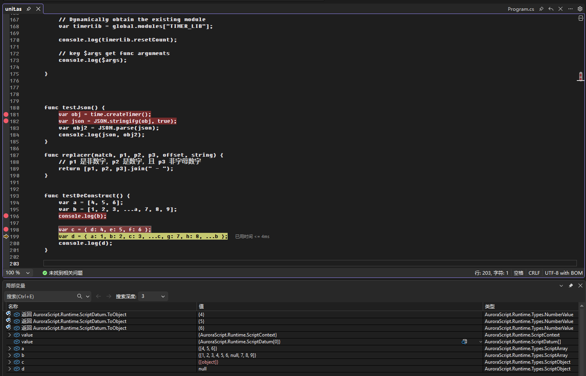
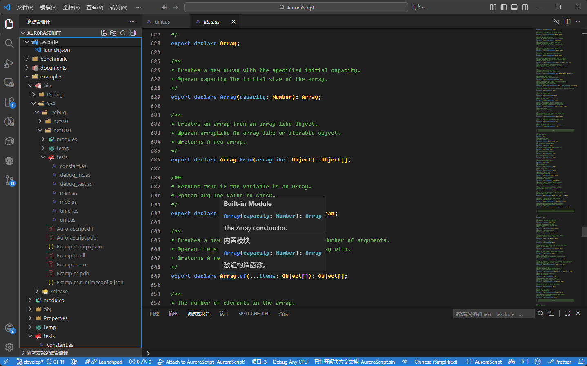

<p align="center">
  
</p>

<p align="center">
  <a href="./README_CN.md">简体中文</a> | <a href="./README.md">English</a>
</p>

# AuroraScript

[](LICENSE)
[](https://github.com/l2060/AuroraScript)
[](package.json)

AuroraScript 是一个基于 .NET 构建的轻量级、弱类型脚本执行引擎。它将脚本编译为字节码，并在定制的高性能虚拟机（VM）上运行，旨在快速、易于嵌入和使用。

虽然在语法和机制上借鉴了 JavaScript，但 AuroraScript 是一门独立的语言，拥有自己的优化和特性，并不遵守 ECMA 规范。它支持原生 .NET 集成和调试功能。

> [!NOTE]
> 🚧 **Work in Progress**: 本项目仍处于开发阶段，性能和 API 稳定性正在持续改进中。我们非常欢迎大家提交 **PR** 和 **Issue** 来共同壮大 AuroraScript！

## ✨ 特性

- **轻量且快速**：无第三方依赖，采用字节码编译和优化过的 VM 执行。
- **弱类型系统**：类似 JavaScript 的灵活变量类型。
- **原生互操作**：可无缝注册和在脚本中使用 .NET (CLR) 类型和函数。
- **调试支持**：完善的 VS Code 调试器支持（断点、单步执行、变量查看、调用堆栈）。
- **模块化系统**：
  - 支持 `import xxx from 'xxx'` 导入模块导出项。
  - 支持 `include 'xxx.as'` 直接嵌入脚本文件。
  - 支持 `@module("MODULENAME")` 自定义模块名称。
- **高级控制流**：
  - 支持 `yield` 指令进行执行中断。
  - 支持 `debugger` 指令进行编程式断点。
  - 支持宿主控制的中断（Interruption）与继续（Continue）机制。
  - 增强的 `where` / `for` 循环支持。
- **现代语法支持**：
  - 支持闭包（Closures）、Lambda 表达式和函数指针。
  - 对象解构：`var { a, b } = obj;`。
  - 数组解构：`var [ a, ...b ] = arr;`。
  - 展开运算符（Spread Operator）：`...` 支持数组和对象展开。
  - 文本模板：支持多行文本模板（`` ` `` 或 `|>` 语法）。
- **标准库**：内置 `Math`, `JSON`, `Date`, `Regex`, `StringBuffer` 等实用对象。

## 🚀 快速开始

### NuGet 安装

您可以通过 NuGet 快速安装 AuroraScript 引擎：

```bash
dotnet add package AuroraScript
```

### 手动安装

克隆仓库到本地：

```bash
git clone https://github.com/l2060/AuroraScript.git
cd AuroraScript
```

### 编译项目

构建核心引擎库：

```bash
dotnet build src/AuroraScript.csproj -c Release
```

## 📖 使用指南

### 运行脚本 (宿主程序)

在您的 .NET 应用程序中托管引擎：

```csharp
using AuroraScript;
using AuroraScript.Runtime;

// 1. 初始化引擎配置
var options = EngineOptions.Default.WithBaseDirectory("./scripts/");
var engine = new AuroraEngine(options);

// 2. 注册 CLR 类型或函数 (可选)
engine.RegisterClrType(typeof(Math), "Math2");

// 3. 编译脚本
await engine.BuildAsync();

// 4. 创建 Domain 并执行
var domain = engine.CreateDomain();
// 执行 'MAIN' 模块中的 'main' 函数
domain.Execute("MAIN", "main");
```

### 编写脚本

语法示例：

```javascript
@module("MAIN");

func main() {
    console.log("你好, AuroraScript!");

    // 调用注册的 CLR 库
    var res = Math2.Abs(-100);
    console.log("Abs 结果: " + res);

    var list = [1, 2, 3, 4, 5];
    for (var item in list) {
        if (item % 2 == 0) {
            console.log("偶数: " + item);
        }
    }
}
```

## 🐞 脚本调试

AuroraScript 支持功能完备的 VS Code 调试体验。

### 1. 扩展安装

1.  **打开项目**：在 VS Code 中打开 `vscode-extension` 文件夹。
2.  **安装依赖**：运行 `npm install`。
3.  **打包插件**：运行 `npm run package` 生成 `.vsix` 文件。
4.  **安装插件**：在 VS Code 扩展菜单中选择 "Install from VSIX..." 安装该文件。

### 2. 配置调试器

在脚本根目录创建 `.vscode/launch.json`：

```json
{
    "version": "0.2.0",
    "configurations": [
        {
            "type": "AuroraScript",
            "request": "attach",
            "name": "Attach to AuroraScript",
            "host": "localhost",
            "port": 26010
        }
    ]
}
```

### 3. 启动调试

1.  在 C# 宿主中启用调试并等待连接：
    ```csharp
    engine.EnableDebugger();
    await engine.WaitAnyDebugger(TimeSpan.FromSeconds(60));
    ```
2.  运行宿主程序。
3.  在 VS Code 中按 `F5` 附加调试器。

### 调试功能
- **断点 (Breakpoints)**：在 `.as` 文件中自由设置断点。
- **单步执行**: 支持 F10 (Step Over), F11 (Step Into), Shift+F11 (Step Out).
- **变量查看**: 支持查看对象、数组、闭包及本地变量。
- **调用堆栈**: 清晰展示脚本调用层级。
- **`debugger` 指令**: 在代码中支持 `debugger;` 关键字触发断点。



*内置类型定义文件提供智能提示支持：*


## 📚 内置 API (Built-in API)

AuroraScript 运行时提供了一套核心的标准库支持。

### 核心类型 (Core Types)

| 类型 | 描述 | 常用方法 |
| :--- | :--- | :--- |
| **Object** | 基础对象类型 | `keys()`, `values()`, `assign()`, `toString()` |
| **String** | 字符串 | `length`, `substring`, `indexOf`, `split`, `replace`, `trim` |
| **Number** | 数值 | `toFixed`, `toString`, `isNaN` |
| **Boolean** | 布尔值 | `toString`, `valueOf` |
| **Array** | 数组 | `push`, `pop`, `shift`, `slice`, `splice`, `join`, `map` |
| **Function** | 函数 | `call`, `apply`, `bind` |

### 标准库 (Standard Library)

| 对象 | 描述 | 常用方法 |
| :--- | :--- | :--- |
| **console** | 终端输入输出 | `log(msg)`, `error(msg)`, `warn(msg)` |
| **Math** | 数学库 | `sin`, `cos`, `tan`, `sqrt`, `pow`, `random`, `PI`, `E` |
| **JSON** | JSON 序列化 | `parse(string)`, `stringify(object)` |
| **Date** | 日期时间 | `now()`, `parse(string)`, 构造函数 `new Date()` |
| **Regex** | 正则表达式 | 构造函数 `new Regex(pattern)`, `match(str)`, `replace(str, repl)` |
| **StringBuffer** | 字符串构建器 | `append(str)`, `toString()`, 高性能字符串拼接 |

### 全局上下文
- `global`: 指向当前 Domain 的全局作用域。
- `$state`: 访问用户注入的状态对象 (通过 C# `ExecuteOptions.WithUserState` 传入)。
- `$args`: 当前函数的入参数组。

## 📊 性能基准 (Benchmark)

我们在性能优化上投入了大量精力，但仍有提升空间。欢迎社区贡献代码！

| 方法 | 平均耗时 (Mean) | 标准差 (StdDev) | 内存分配 |
| :--- | :---: | :---: | :---: |
| **TestIfTrue** | 225.1 ns | 0.19 ns | - |
| **TestAssuming** | 227.0 ns | 0.51 ns | - |
| **TestAddVar** | 240.6 ns | 0.50 ns | - |
| **TestGetVar** | 243.5 ns | 0.37 ns | - |
| **TestSetVar** | 250.7 ns | 0.39 ns | - |
| **TestSetProperty** | 257.0 ns | 1.05 ns | 48 B |
| **TestGetProperty** | 269.3 ns | 0.44 ns | - |
| **TestClone** | 515.6 ns | 1.34 ns | 1072 B |
| **TestIterator** | 822.1 ns | 2.09 ns | 1056 B |
| **TestJson** | 1,907.2 ns | 6.53 ns | 4520 B |
| **TestRegex** | 3,604.4 ns | 7.77 ns | 8696 B |
| **TestStrings** | 979.7 $\mu$s | 3.27 $\mu$s | 3.48 MB |
| **TestClosure** | 1.00 ms | 2.27 $\mu$s | 496 B |
| **TestObjects** | 1.38 ms | 5.06 $\mu$s | 5.14 MB |
| **TestArrays** | 1.40 ms | 15.13 $\mu$s | 2.22 MB |
| **TestFor100W** | 10.25 ms | 112.7 $\mu$s | - |

> 测试环境: Intel Core i7-13700KF, .NET 10.0.1.

## 📂 示例

- [**Basic Tests**](examples/tests/main.as): 语法结构和模块加载示例。
- [**Benchmarks**](benchmark/scripts/unit.as): 性能测试脚本。

---

Made with ❤️ by [l2060](https://github.com/l2060)
